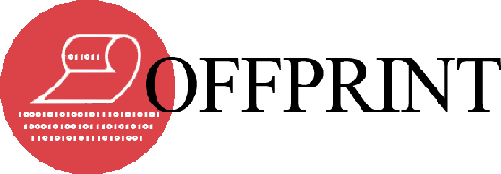

# offprint

A pipeline for making an offprint of a EuPathDB website on to a virtual appliance.

### Features

- Imports, over network link, the source website's application and user databases to destination databases on the appliance. This helps ensure that the database is in sync with the website application code.
- Website source code is checked out from SCM at the same revision as the source website. This helps ensure that the code is in sync with the databases (in particular, with the tuning tables).

### Requirements
- The source databases require an account with the `EXP_FULL_DATABASE` role.
- Virtual machine cloned from our standard template.
  - Prepped with Puppet's sa.pp node manifest, which includes
    - Oracle software (offprint will create the databases)
    - Apache HTTP Server framework
    - Tomcat Instance Framework
    - userdb disk image mounted at /u02/oradata/userdb
      - the volume must be large enough to hold the user database
    - appdb disk image mounted at /u02/oradata/appdb
      - the volume must be large enough to hold the application database
    - vmbuilder disk image mounted at /vmbuilder
    - existing tnsnames.ora with appdb and userdb entries
- The source website must have a functional /dashboard app. 
  - The destination machine must have access to the source /dashboard API.
    - e.g. `curl toxodb.org/dashboard/xml`
- The user running offprint must have root privileges in /etc/sudoers with no password, e.g.
  - `%vmbulder ALL   = (ALL) NOPASSWD:ALL`
  - See note about the `vmbuilder` user below.

#### Recommeded

The standard KVM virtual machine template includes the user 'vmbuilder' whose home is provided by a dedicated virtual disk. Run offprint as this user. When converting from KVM to VMWare the vmbulder home disk is excluded, thereby reducing security exposure from vmbuilder's shell history and offprint configuration files.

### Usage

Set env variables (optional)

- OPR_HOME (default: /opt/opr) - location of offprint source code
- OPR_WD (default: $HOME/.opr) - offprint working directory for temporary files and logs
- OPR_CONF (default: $HOME/offprint.conf) - configuration for an offprint instance

**offprint**

#### Individual Commands

Typically you want to run `offprint` to do a complete setup but you can run individual steps if you need to patch specific components or are debugging the pipeline. Be aware that running individual steps can have unintended consequences, for example re-importing a database may result in one that is out of sync with the WDK application code.

**oprdb**

**oprsite**

**oprdatafiles**

### Need To Know

- `offprint` installs the same revision of source code as found on the source website (as reported by the /dashboard API).
  - Therefore, committing a bug fix to the relevant branch is not sufficient for the VM to acquire that fix. You must first rebuild the source website so /dashboard reflects the correct revision.

### Action Overview

The following is a high-level summary of what each script does.

**oprdb**

  - for each userdb and appdb
    - gets name of source database from /dashboard API of source website
    - creates network link from destination to source databases
    - imports from source to destination (VM) database over that network link
    - patches destination database with objects present in source database but not imported
      - add database link from AppDB to UserDB
      - add UTL_INADDR ACL (needed by /dashboard)
    - patches destination database with VM-specific objects
      - `vmuser` database accounts for WDK

**oprsite**

**oprdatafiles**
    
### Known Issues

  - FK constraints in userlogins tables such as STEPS and STRATEGIES are lost when filtering the expdp of WDK userlogins users because of the missing parent keys. I would need to similarly filter those other tables but that's too much maintenance at this point - I have to reverse engineer the references each time the UserDB schema changes.

  - Personal WDK profile data may not be scrubbed. I can only remove profile data (such as passwords, email addresses) if I know about it. Some data is obvious (userlogins.users.password) but I have not done a full inspection of every field so there may be caches of data that is not cleaned.
  
  - UserDB GBROWSEUSERS.SESSIONS has long columns, and longs can not be loaded/unloaded using a network link. This is ok.

### ToDo

  - install jolokia webapp for /dashboard
  - not exp databases if tuningManager is running